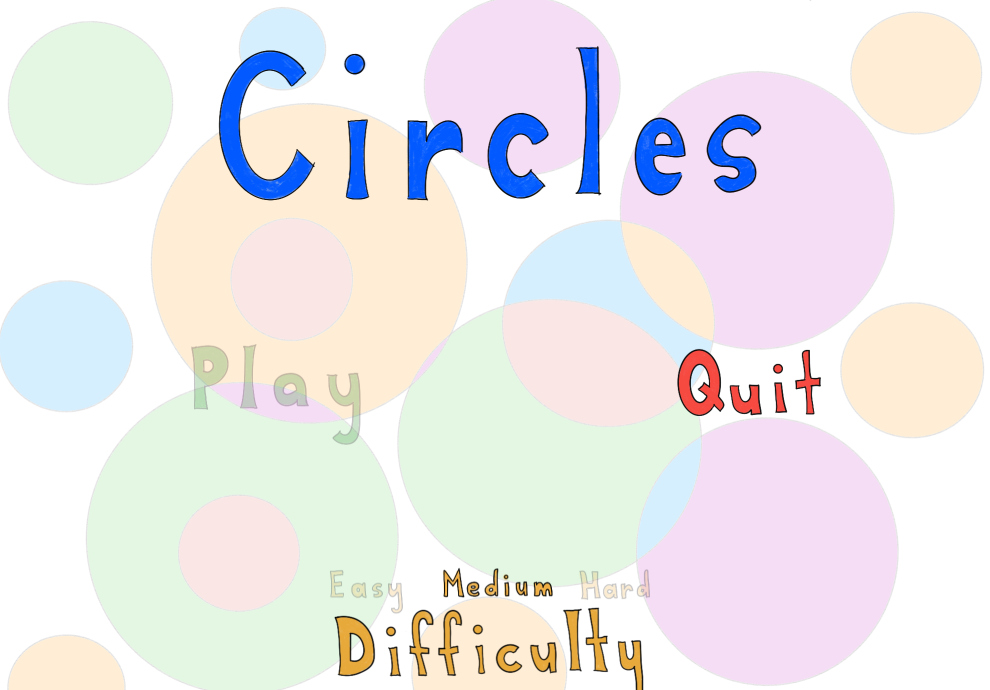
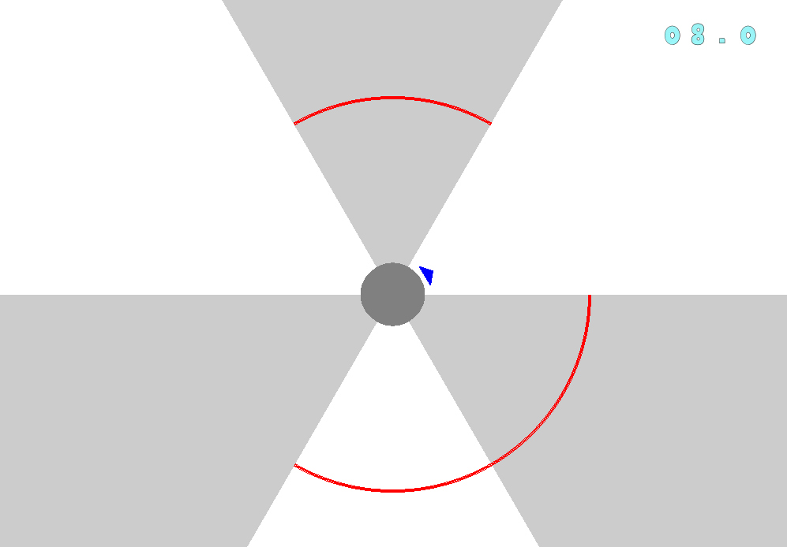

# Travail pratique 3 : Le jeu *Circles*

## Description

Le but du projet est de concevoir un jeu vidéo nommé Circles, fortement inspiré du jeu Super Hexagon de Terry Cavanagh. Le projet sera réalisé en utilisant la librairie graphique SDL2.
Cours: Construction et maintenance de logiciels (INF3135) Universtié du Québec à Montréal 

## Auteurs

- Charles Morin (MORC28019804)
- Philippe Koclas (KOCP30079800)

## Dépendances

* [SDL2](https://www.libsdl.org/), librairie d'affichage graphique en c.
* [SDL2_gfx](http://www.ferzkopp.net/wordpress/2016/01/02/sdl_gfx-sdl2_gfx/), ajoute des fonctions à SDL2.
* [SDL_image 2.0](https://www.libsdl.org/projects/SDL_image/), librairie pour les sprites. 
* [SDL_mixer 2.0](https://www.libsdl.org/projects/SDL_mixer/), librairie pour les effets sonnores.


## Fonctionnement

Pour compiler il suffit d'aller dans le dossier ```src``` et d'éffectuer la commande ```make```.
Pour exécuter le programme, il faut faire ```./circles```.
Pour naviguez dans le menu, il faut utiliser les flèches du clavier.
Avant de commencer une partie, la sélection d'une difficutlé est obligatoire.
Le bouton "Play" permet de lancer une partie et le bouton "Quit" permet de quitter le jeu.
Le but du jeu est de déplacer le triangle avec les flèches du clavier, pour évité les murs
qui s'approche au fur et à mesure. Si le joueur touche un mur, la partie est terminé.
Un chronomètre augmente durant la partie pour indiquer au joueur son score.
La figure ci-bas illustre le menu du jeu.

La figure ci-bas illustre une partie en cours.


## Plateformes supportées

* Ubuntu 18.04

## Références

* [Super Hexagon](https://terrycavanaghgames.com/hexagon/), le jeu Super Hexagon de TerryCavanagh.
* [SDL2](https://www.libsdl.org/), documentation sur les fonctions SDL2.

## Division des tâches

* [X] Gestion du menu (Philippe)
* [X] Affichage de la scène (Charles)
* [X] Affichage du chronomètre (Philippe)
* [X] Animation des murs (Charles)
* [X] Animation du joueur (Charles)
* [X] Détection des collisions (Charles)
* [X] Affichage d'une partie terminée (Charles)
* [X] Gestion de la musique principale (Charles)
* [X] Gestion des sons lorsqu'on navigue dans le menu (Charles)
* [X] Gestion de la musique de fin de partie (Charles)
* [X] Documentation et requêtes d'intégration (Philippe)

## État du projet

Projet complété sans bogue.
